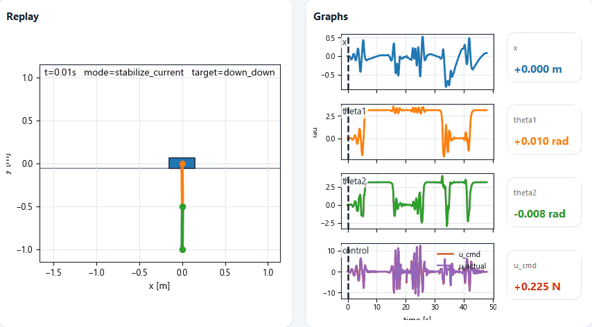

# Double Link Pendulum Control and Recovery

A MATLAB backend and Python GUI project for simulating, evaluating and visualizing a cart mounted double link pendulum. The project focuses on multi target transition control, external force recovery and result inspection through a lightweight Python viewer.



## Overview

This repository separates computation and visualization clearly:

- **MATLAB backend** computes nonlinear dynamics, controllers, recovery simulations, metrics and exported result files.
- **Python GUI frontend** loads MATLAB generated data and provides replay animation, state graphs and recovery metric inspection.

The Python layer does not replace the controller. It is a viewer for validated MATLAB outputs.

## Main features

- Nonlinear cart double link pendulum model.
- Target equilibrium set for Down Down, Up Up, Up Down and Down Up configurations.
- Multi target switching simulation with route planning and tracking control.
- External force recovery matrix for disturbed transition cases.
- Compact recovery backend organized by engine, controllers, metrics, variants, IO and utilities.
- Python GUI for replaying trajectories, plotting states and inspecting force recovery metrics.
- Regression tests for the Python result loading and GUI workflow layer.

## Repository structure

```text
matlab/                 MATLAB backend
  config/               run configuration
  control/              target, LQR, TVLQR and recovery controllers
  dynamics/             nonlinear plant dynamics
  evaluation/           metrics, export and release helpers
  params/               physical and simulation parameters
  recovery/             recovery matrix backend
  simulation/           switching and robustness workflows

python/                 Python GUI frontend
scripts/                public MATLAB entry scripts
sample_results/         portable sample results for the GUI and tests
results/                runtime result location
docs/                   user guide and technical notes
tests/                  Python and MATLAB smoke tests
assets/                 README images and GUI demo media
```

## MATLAB backend

Run MATLAB from the repository root.

```matlab
run('matlab/startupProject.m')
```

Generate the recovery matrix:

```matlab
run('scripts/runRecoveryMatrix.m')
```

Run the robustness summary:

```matlab
run('scripts/runRobustnessSuite.m')
```

Build the release package:

```matlab
run('scripts/buildReleasePackage.m')
```

Export GUI case metrics manually:

```matlab
run('scripts/exportGuiCaseMetrics.m')
```

## Python GUI

Install dependencies:

```bash
pip install -r requirements.txt
```

Start the GUI:

```bash
python python/gui/runGui.py
```

The GUI loads MATLAB exported results, replays the cart pendulum motion, plots state trajectories and displays recovery case metrics.

## Tests

Run Python tests:

```bash
python -m pytest -q
```

Run MATLAB smoke tests:

```matlab
run('matlab/startupProject.m')
run('tests/matlab/smokeTestProject.m')
run('tests/matlab/testBackendRefactor.m')
```

The MATLAB smoke tests verify project startup, parameter loading, target library access, recovery configuration, output paths and backend module availability.

## Result layout

```text
results/switching/          switching simulation output
results/recovery/           recovery matrix output and GUI metrics
results/recoveryBaseline/   baseline recovery metrics
results/robustness/         robustness summary generated at runtime
results/final_demo/         release package generated at runtime
```

Generated logs, runtime summaries and release zip files should normally stay out of version control unless they are intentionally published as release evidence.

## Architecture

```text
MATLAB backend
  dynamics -> control -> simulation/recovery -> metrics/export
                                      |
                                      v
Python GUI frontend
  load results -> replay animation -> graph states -> inspect metrics
```

This structure keeps the control and simulation logic in MATLAB while keeping the user facing visualization layer in Python.

## Current limitation

The constrained recovery backend preserves the validated control logic. Some difficult upright recovery cases remain the main performance bottleneck. Deep controller changes should be made only after adding stronger MATLAB regression tests.
